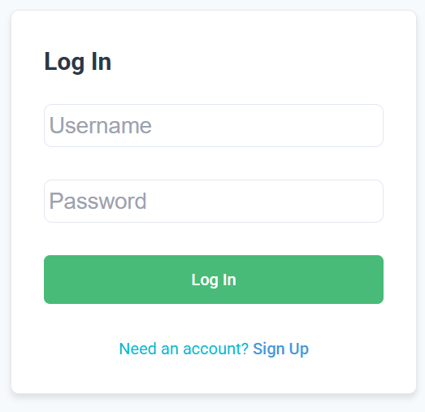
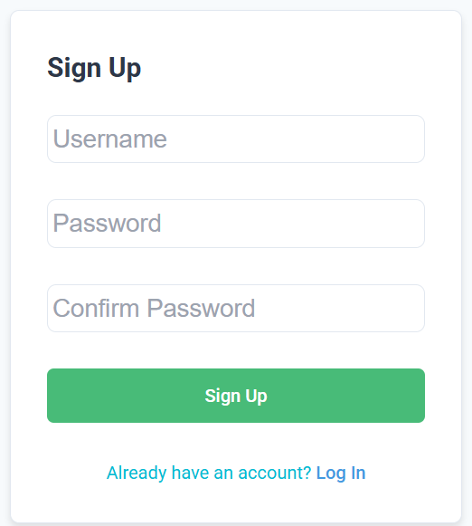
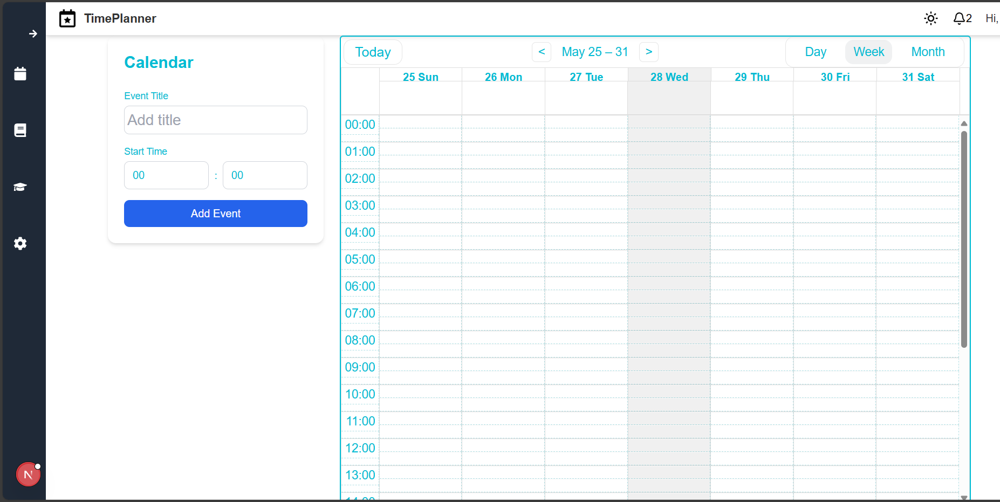
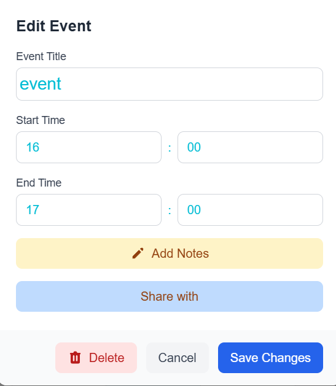
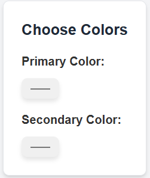
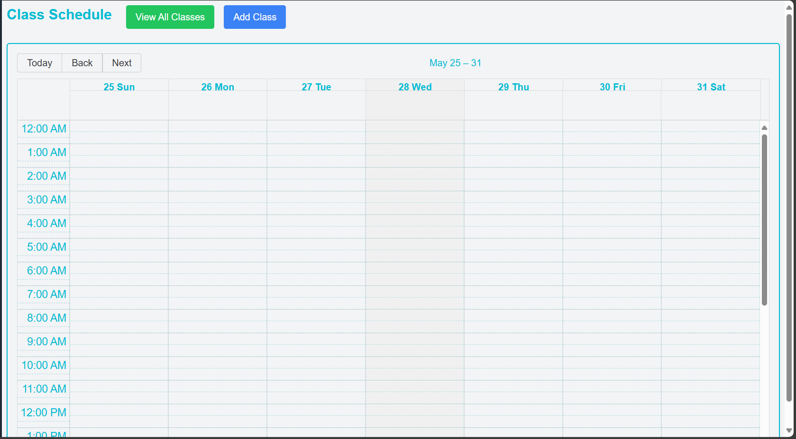
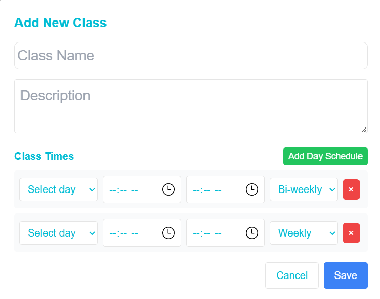
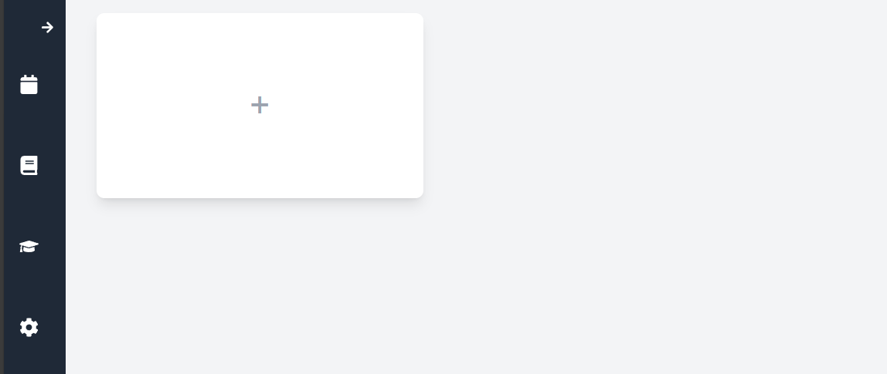

## Getting Started
Setting up the database:
First, make sure you have XAMPP on your computer. You can download it from this link https://www.apachefriends.org/download.html. After installing it you need to open XAMPP Control and start Apache and MySQL services. After the services start succesfully you can open PHPMyAdmin tab in your browser by clicking the button Admin in the MySQL row. Nextly find backnend/timedb.sql in Files, download it and then open PHPMyAdmin, in the top bar find button named "Import", click on it, scroll down and you should find button "Import". Import the timedb.sql file into PHPMyAdmin. After completing these steps your database should be hosted on your local network.

Setting up the project environment:
Run this following command after you opened the project folder
```bash
npm install
```


Running the server:
To run the server in terminal you have to execute following commands
```bash
cd time-planner/backend

node server.js
```
Running frontend:
Run this following command to run the frontend locally
```bash
npm run dev
```

Open [http://localhost:3000](http://localhost:3000) with your browser to see the result.
This will load your application, and you should see the login screen along with the sign-up button.

<div align="center">
  
  
</div>

Upon successful login, you'll be redirected to the calendar page.
If you don't have an account, click the Sign Up button to create one.

<div align="center">
  
</div>

To add an event to the calendar, select the desired date, then enter the event’s title, start time, and end time.
After creating the event, double-clicking it will open a window displaying the event’s name and time.
In this window, you'll find two buttons: "Add Notes" and "Share With".
"Add Notes" opens a simple text editor where you can write additional information.
"Share With" allows you to enter the username of another account to share the event with.

<div align="center">
  
</div>

On the left side of the page, there is a sidebar that contains "Settings", "Schedule", and "Notebook".
In "Settings", you can change the page’s color scheme.

<div align="center">
  
</div>

In "Schedule", you'll find a calendar that displays your added classes.

<div align="center">
  
</div>

Classes are recurring events that take place every week or every other week.

<div align="center">
  
</div>

Lastly, the "Notebook" opens a page where you can create notes containing text, images, and links.

<div align="center">
  
</div>

On the calendar page, the top right corner includes options for dark mode, messages, and a logout button.
You can start editing the page by modifying `app/page.js`. The page auto-updates as you edit the file.

This project uses [`next/font`](https://nextjs.org/docs/app/building-your-application/optimizing/fonts) to automatically optimize and load [Geist](https://vercel.com/font), a new font family for Vercel.
